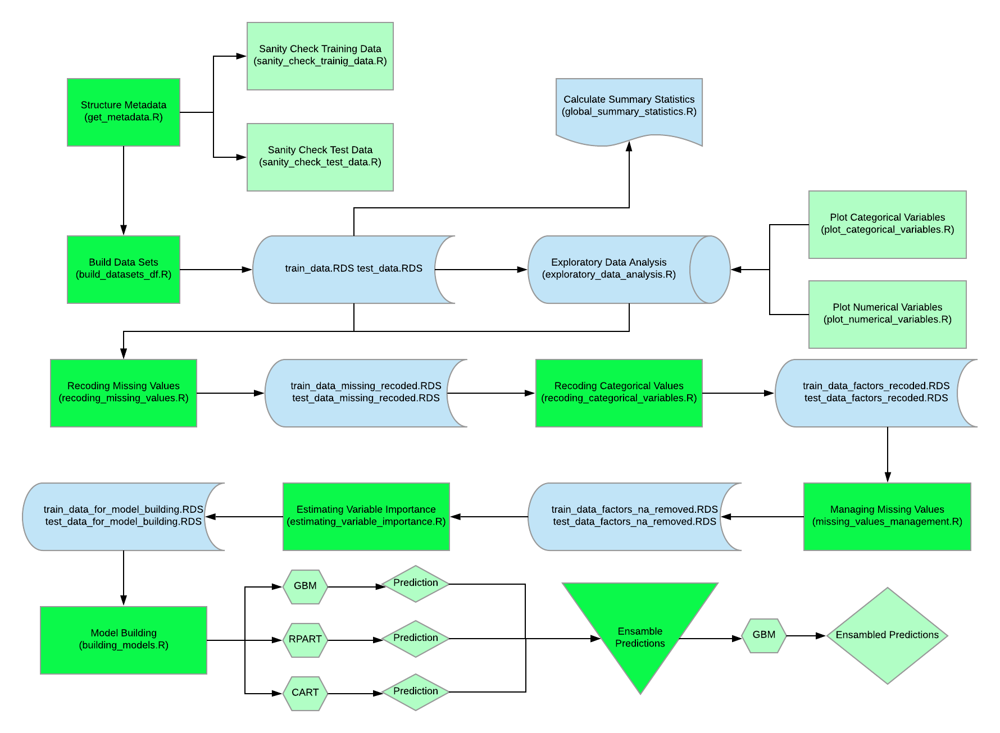

# Predicting Incomes from US Census Bureau Data
**The objective of this project is to model demographic and employment data to predict incomes. The data consists of census data extracted from the Current Population Surveys of 1994 and 1995, conducted by the US Census Bureau.**

### The project is structured along the following framework:
1. **Business Understanding**
2. **Data Understanding**
3. **Data Preparation**
4. **Model Construction**
5. **Model Evaluation**
6. **Model Deployment**
7. **Business Insights**
8. **Conclusions**

# 1. Business Understanding
## Business Objective
The business objective behind this project can be analysed from three different perspective. That of the US Census Bureau conducting the surveys, that of governments and institutional actors, and that of the private sector:
* **For the Census Bureau:**
    * An accurate prediction model of incomes can help them predict subjects' incomes in areas where they don't have actual data on incomes.
    * This can enhance the quality of the data for areas where data is sparse or methodologically questionable.
    * It can also significantly reduce for them the cost of data collection, both economic and in terms of manpower.
* **Governments and  institutional actors:**
    * Income is an important indicator for economic and social markers, such as quality of nutrition, access to medical services and utilities, etc.
    * Having more and better insights into income levels of populations can guide better policy design.
* **Private sector:**
    * Income levels tend to have a strong association to disposable income and purchasing power of groups and individuals.
    * Understanding income levels across segments and areas helps companies improve location selection, optimise supply chains, design better pricing strategies, among others.

## Business Success Criteria
The business success criteria for the Census Beureau deriving from this project is defined as follows:
* Increase in accuracy of projections of incomes in the US from one census period to the next. 
* Less estimation errors in modelling year-on-year changes in incomes predictions and associated demographic data between census periods.

## Project Plan

### Click [here for the full jupyter notebook in html form](https://leobeeson-github-objects.s3.eu-west-2.amazonaws.com/US_Census_Bureau_Income_Data.html)
